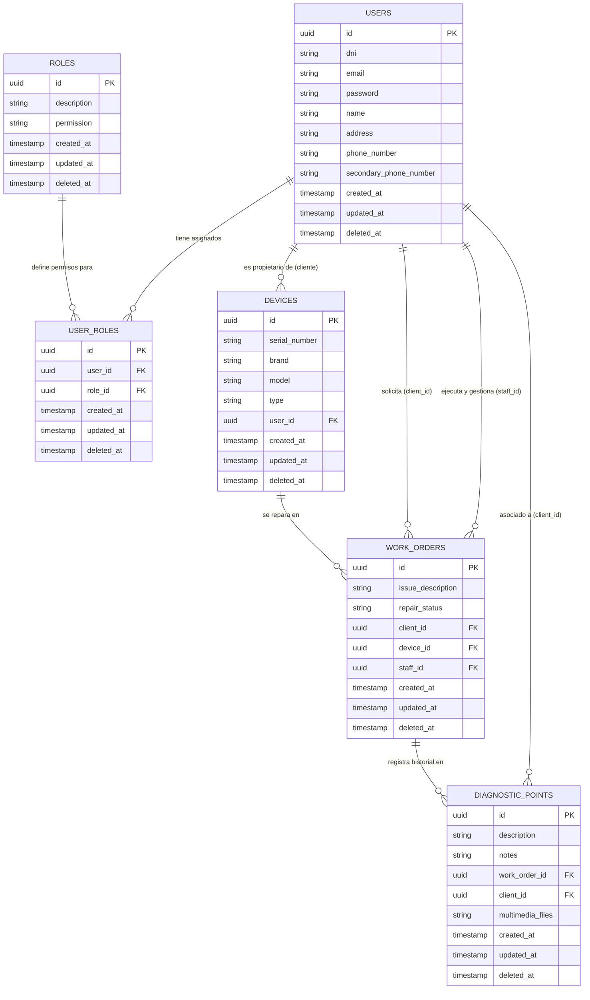

# 🛡️ Viking App - Backend API (Go / Gin / GORM)


> **Servicio Backend de Alto Rendimiento para el Ecosistema Viking-App (El Vikingo Store)**  
> Plataforma de gestión transaccional para talleres de servicio técnico, control de inventario de equipos, seguimiento de órdenes de trabajo en tiempo real y registro de evidencias multimedia.

> 📱 **¿Buscas el Frontend de la Aplicación?**  
> Consulta nuestro repositorio cliente en React Native / Expo y React Web: [Viking-App Frontend](https://github.com/mirazopablo/Viking-App-Front)

---

## 📋 Sobre el Proyecto

Esta API REST constituye el núcleo arquitectónico de **Viking App**, una solución integral diseñada para optimizar los flujos operativos de talleres técnicos y servicios de reparación de computadoras, consolas y dispositivos móviles. 

El proyecto representa una evolución y **migración arquitectónica desde Spring Boot (Java) hacia Go (Golang)** utilizando el framework web **Gin** y el ORM **GORM**. El objetivo de esta reingeniería es lograr una **latencia ultra baja**, un consumo de memoria mínimo (*footprint* reducido) y una alta capacidad de concurrencia nativa (Goroutines) sin estado (*stateless*).

---

## 🏗 Arquitectura de Datos y MER (Modelo Entidad-Relación)

El sistema está modelado sobre una base de datos relacional altamente normalizada, centrada en el ciclo de vida de las **Órdenes de Trabajo (`work_orders`)** y los **Dispositivos (`devices`)**. Utiliza identificadores universales **UUID v4** como claves primarias y mecanismo de borrado lógico (**Soft Deletes** a través de `deleted_at`) para garantizar trazabilidad y auditoría.



---

## 🛠 Stack Tecnológico y Dependencias

### Core & Framework
* **Lenguaje:** [Go 1.26+](https://golang.org/)
* **Router / Web Framework:** [Gin Web Framework v1.12.0](https://github.com/gin-gonic/gin) - Enrutamiento HTTP de alto rendimiento.
* **Manejo de Configuración:** `godotenv` - Gestión segura de variables de entorno por archivo `.env`.

### Persistencia y Base de Datos
* **ORM:** [GORM v1.31.2](https://gorm.io/) - Mapeo objeto-relacional con soporte de ganchos (*hooks*) transaccionales.
* **Drivers de Base de Datos:** Soporte multi-motor para **PostgreSQL** (`gorm.io/driver/postgres`) y **MySQL/SQLite**.
* **Almacenamiento de Archivos:** Gestión en sistema de archivos local (`uploads/`) con soporte de transmisión por bloques (`multipart/form-data`).

### Seguridad & Autenticación
* **Estándar:** JWT Stateless (JSON Web Tokens).
* **Librería Criptográfica:** `golang-jwt/jwt/v5` - Firma y verificación HMAC-SHA256/512.
* **Hashing de Contraseñas:** `golang.org/x/crypto/bcrypt` - Hashing adaptativo seguro con salt nativo.
* **Control de Acceso:** Middleware personalizado para RBAC (*Role-Based Access Control*: `ADMIN`, `STAFF`, `CLIENT`).

### Documentación y API Contract
* **Generador de Documentación:** [Swaggo (`swaggo/gin-swagger`)](https://github.com/swaggo/gin-swagger) - Integración nativa de Swagger UI a partir de comentarios y anotaciones de código.
* **Especificaciones:** OpenAPI 3.0 / Swagger 2.0 (`openapi.yaml`, `docs/swagger.json`).

---

## 📂 Estructura Arquitectónica del Proyecto

El código está estructurado siguiendo los principios de **Clean Architecture** (Arquitectura Limpia) y separación estricta por capas horizontales de responsabilidad:

```text
viking-app-go/
├── config/                  # Inicialización y configuración del sistema
│   ├── config.go            # Carga y validación de variables de entorno (.env)
│   └── database.go          # Conexión a base de datos y auto-migración de esquemas GORM
├── controllers/             # Capa de Presentación (REST Handlers)
│   ├── auth_controller.go   # Endpoints públicos de login y registro
│   ├── device_controller.go # Gestión del inventario de equipos tecnológicos
│   ├── ...                  # Controladores por dominio (Usuarios, Roles, Órdenes, Diagnósticos)
│   └── work_order_controller.go
├── docs/                    # Documentación autogenerada por Swaggo
│   ├── docs.go
│   ├── swagger.json
│   └── swagger.yaml
├── middlewares/             # Interceptores y Filtros HTTP
│   └── auth_middleware.go   # Validación criptográfica del Bearer Token y roles RBAC
├── models/                  # Dominio / Entidades de Base de Datos (Tags GORM y JSON)
│   ├── device.go
│   ├── diagnostic_point.go
│   ├── role.go
│   ├── user.go
│   ├── user_role.go
│   └── work_order.go
├── repositories/            # Capa de Acceso a Datos (Patrón Repository / GORM Queries)
│   ├── device_repository.go
│   ├── ...
│   └── work_order_repository.go
├── routes/                  # Configuración centralizada del enrutador Gin y grupos /api, /auth
│   └── routes.go
├── services/                # Capa de Lógica de Negocio (Reglas de negocio y transacciones)
│   ├── device_service.go
│   ├── jwt_service.go       # Emisión, firma y verificación de tokens de acceso
│   ├── ...
│   └── work_order_service.go
├── uploads/                 # Almacenamiento local de evidencias multimedia (Ignorado por Git)
├── Viking_app_documentation.md # Manual técnico detallado del proyecto en español
├── openapi.yaml             # Contrato estático OpenAPI 3.0
├── main.go                  # Punto de entrada de la aplicación Go
├── go.mod / go.sum          # Gestión de dependencias del módulo Go
└── README.md                # Este documento
```

---

## 🚀 Guía de Inicio Rápido (Getting Started)

### 1. Prerrequisitos
* **Go** instalado en el sistema (Versión recomendada: `1.26+` o superior).
* Servidor de base de datos **PostgreSQL** o **MySQL** activo.
* Herramienta de control de versiones **Git**.

### 2. Clonar el Repositorio
```bash
git clone git@github.com:mirazopablo/viking-app-go.git
cd viking-app-go
```

### 3. Configuración de Variables de Entorno
Crea tu archivo de entorno local copiando la plantilla de ejemplo:
```bash
cp .env.example .env
```

Edita el archivo **`.env`** con tus credenciales locales:
```ini
# Puerto del Servidor HTTP
PORT=8080

# Configuración de Base de Datos
DB_HOST=localhost
DB_USER=postgres
DB_PASSWORD=secret_password
DB_NAME=viking_db
DB_PORT=5432
DB_SSLMODE=disable

# Seguridad JWT (Secreto criptográfico HMAC mínimo 256 bits)
JWT_SECRET=TU_CLAVE_SECRETA_SUPER_SEGURA_PARA_FIRMAR_TOKENS
JWT_EXPIRATION_HOURS=24
```

### 4. Descargar Dependencias y Ejecutar
Instala los módulos de Go y levanta el servidor de desarrollo:
```bash
go mod download
go run main.go
```
La API iniciará en `http://localhost:8080` y ejecutará la sincronización automática de modelos (`AutoMigrate`).

---

## 📚 Documentación de la API (Swagger UI & OpenAPI)

El proyecto cuenta con documentación interactiva en tiempo real gracias a la integración nativa con **Swagger UI**. Puedes explorar los endpoints, probar llamadas REST y verificar esquemas DTO directamente desde el navegador:

> 🌐 **Swagger UI Interactivo:** `http://localhost:8080/swagger/index.html`  
> 📄 **Contrato OpenAPI YAML:** Disponible localmente en [openapi.yaml](file:///mnt/GitHub/viking-app-go/openapi.yaml) o [Viking_app_documentation.md](file:///mnt/GitHub/viking-app-go/Viking_app_documentation.md)

---

## 🔒 Flujo de Seguridad y Roles (RBAC Stateless)

El sistema utiliza autenticación sin estado mediante **JSON Web Tokens (JWT)**. Para interactuar con rutas protegidas:

1. **Autenticación:** Realiza un `POST` a `/auth/login` con tus credenciales (`email` y `password`).
2. **Obtención de Token:** Recibirás una cadena JWT firmada criptográficamente en el servidor.
3. **Peticiones Autorizadas:** Envia el token en el encabezado HTTP de tus peticiones hacia `/api/*`:
   ```http
   Authorization: Bearer <tu_jwt_token_aqui>
   ```

### Jerarquía de Roles
* **`ADMIN`**: Acceso total al sistema, gestión de usuarios, catálogo de roles y eliminación física/lógica de registros.
* **`STAFF`**: Técnicos de taller. Pueden registrar equipos, gestionar estados de órdenes de trabajo (`RECEIVED`, `IN_PROGRESS`, `DONE`, `WITHDRAWN`), buscar clientes y adjuntar diagnósticos con fotos.
* **`CLIENT`**: Usuarios finales. Acceso de solo lectura a sus propios equipos y al historial y estado de sus órdenes de trabajo en tiempo real.

---

## 🤝 Convención y Protocolo de Commits

El desarrollo del proyecto respeta estrictamente la especificación **Conventional Commits** (usualmente mediante **Commitizen / `cz-git`**) con mensajes estructurados siempre en **inglés**:

* `feat`: Nuevas características o funcionalidades de la API.
* `fix`: Corrección de errores o bugs.
* `docs`: Cambios exclusivos en documentación (`README.md`, Swagger, comentarios).
* `style`: Formateo de código, linting, espacios (sin cambios en lógica).
* `refactor`: Refactorización de código existente (sin agregar features ni corregir bugs).
* `perf`: Mejoras de rendimiento o consultas de base de datos optimizadas.
* `test`: Creación o corrección de pruebas unitarias/de integración.
* `chore`: Mantenimiento de herramientas de compilación, `go.mod`, scripts o CI/CD.

---

*Made with ❤️ by Viking Labs & El Vikingo Store*
