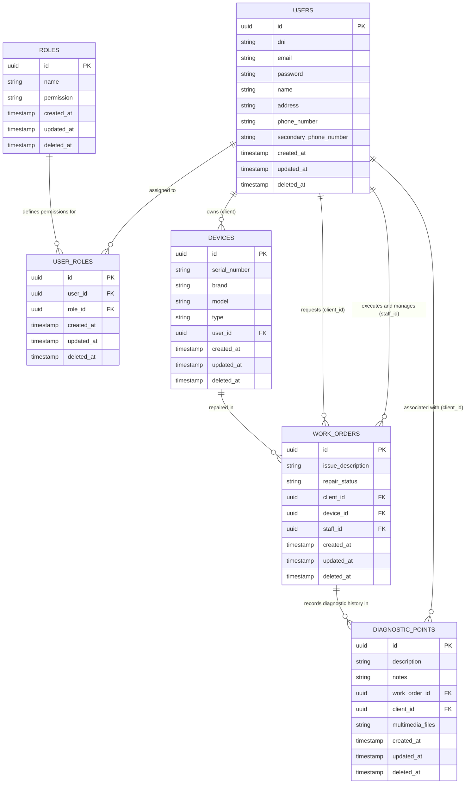

# 🛡️ Viking App - Backend API (Go / Gin / GORM)


> **High-Performance Backend Service for the Viking-App Ecosystem (El Vikingo Store)**  
> Transactional management platform for technical repair shops, inventory tracking of technological devices, real-time work order lifecycle management, and multimedia diagnostic evidence logging.

> 📱 **Looking for the Frontend Application?**  
> Check out our client repository built with React Native / Expo and React Web: [Viking-App Frontend](https://github.com/mirazopablo/Viking-App-Front)

---

## 📋 About The Project

This REST API serves as the core architectural backbone of **Viking App**, an integrated platform designed to streamline operational workflows for technical service shops, computer repair centers, mobile device technicians, and game console repair laboratories.

This project represents an architectural evolution and **migration from Spring Boot (Java) to Go (Golang)** using the **Gin** web framework and **GORM** ORM. The primary goal of this reengineering effort is to achieve **ultra-low latency**, a minimal memory footprint, and native stateless high concurrency leveraging Go routines.

---

## 🏗 Data Architecture & ERD (Entity-Relationship Diagram)

The system is modeled on a highly normalized relational database focused on the lifecycle of **Work Orders (`work_orders`)** and **Devices (`devices`)**. It utilizes universal **UUID v4** identifiers as primary keys and a logical soft-delete mechanism (**Soft Deletes** via `deleted_at`) to ensure data immutability, traceability, and comprehensive audit trails.



---

## 🛠 Tech Stack & Dependencies

### Core & Framework
* **Language:** [Go 1.26+](https://golang.org/)
* **Router / Web Framework:** [Gin Web Framework v1.12.0](https://github.com/gin-gonic/gin) - High-performance HTTP web framework and routing engine.
* **Configuration Management:** `godotenv` - Secure environment variable loading via `.env` configuration files.

### Persistence & Database
* **ORM:** [GORM v1.31.2](https://gorm.io/) - Developer-friendly ORM supporting transactional callbacks, associations, and hooks.
* **Database Drivers:** Multi-engine database driver support for **PostgreSQL** (`gorm.io/driver/postgres`), **MySQL**, and **SQLite**.
* **File Storage:** Local filesystem storage (`uploads/`) supporting multipart chunked streaming (`multipart/form-data`) for diagnostic media attachments.

### Security & Authentication
* **Standard:** Stateless JWT (JSON Web Tokens).
* **Cryptographic Library:** `golang-jwt/jwt/v5` - HMAC-SHA256/512 token signing and verification.
* **Password Hashing:** `golang.org/x/crypto/bcrypt` - Secure adaptive bcrypt hashing with automatic salting.
* **Access Control:** Custom middleware enforcing RBAC (*Role-Based Access Control*: `ADMIN`, `STAFF`, `CLIENT`).

### Documentation & API Contract
* **Documentation Generator:** [Swaggo (`swaggo/gin-swagger`)](https://github.com/swaggo/gin-swagger) - Automated Swagger UI integration generated directly from code annotations and docstrings.
* **Specifications:** OpenAPI 3.0 / Swagger 2.0 (`openapi.yaml`, `docs/swagger.json`).

---

## 📂 Architectural Project Structure

The codebase strictly adheres to **Clean Architecture** principles and horizontal layer separation of concerns:

```text
viking-app-go/
├── cmd/                     # Standalone CLI tools and executable commands
│   └── seeder/              # Interactive console database seeder tool (main.go)
├── config/                  # System initialization and configuration management
│   ├── config.go            # Environment variable loading (.env) and struct parsing
│   └── database.go          # Database connection pool and automatic GORM schema migrations
├── controllers/             # Presentation Layer (REST HTTP Handlers)
│   ├── auth_controller.go   # Public authentication endpoints (login, registration)
│   ├── device_controller.go # Device inventory management handlers
│   ├── ...                  # Domain-specific controllers (Users, Roles, Orders, Diagnostics)
│   └── work_order_controller.go
├── docs/                    # Automated Swagger documentation artifacts
│   ├── docs.go
│   ├── swagger.json
│   └── swagger.yaml
├── middlewares/             # HTTP Interceptors and Filters
│   ├── auth_middleware.go   # Cryptographic Bearer Token validation and RBAC authorization
│   └── logger_middleware.go # Structured request logging and panic recovery
├── models/                  # Domain Layer / Database Entities (GORM and JSON tags)
│   ├── device.go
│   ├── diagnostic_point.go
│   ├── role.go              # Role entity (standardized Name attribute)
│   ├── user.go              # User entity (supporting nullable secondary phone and optional passwords)
│   ├── user_role.go
│   └── work_order.go
├── repositories/            # Data Access Layer (Repository Pattern / GORM SQL queries)
│   ├── device_repository.go
│   ├── ...
│   └── work_order_repository.go
├── routes/                  # Router configuration and centralized API grouping (/api, /auth)
│   └── routes.go
├── services/                # Business Logic Layer (Domain rules and transactions)
│   ├── device_service.go
│   ├── jwt_service.go       # Access token issuance, rotation, and cryptographic verification
│   ├── ...
│   └── work_order_service.go
├── uploads/                 # Local directory for multimedia diagnostic evidence (Git-ignored)
├── Viking_app_documentation.md # Comprehensive technical project documentation
├── openapi.yaml             # Static OpenAPI 3.0 contract specification
├── main.go                  # Main application entry point and HTTP server lifecycle
├── go.mod / go.sum          # Go module dependencies and checksums
└── README.md                # Project README documentation
```

---

## 🚀 Getting Started Guide

### 1. Prerequisites
* **Go** installed on your operating system (Recommended version: `1.26+` or newer).
* An active **PostgreSQL** or **MySQL** database server instance.
* **Git** version control system.

### 2. Clone the Repository
```bash
git clone git@github.com:mirazopablo/viking-app-go.git
cd viking-app-go
```

### 3. Environment Configuration
Create your local environment configuration file by duplicating the example template:
```bash
cp .env.example .env
```

Edit the **`.env`** file with your local database credentials and security settings:
```ini
# HTTP Server Port
PORT=8080

# PostgreSQL Database Configuration
DB_HOST=localhost
DB_USER=postgres
DB_PASSWORD=secret_password
DB_NAME=viking_db
DB_PORT=5432
DB_SSLMODE=disable

# JWT Security (Minimum 256-bit HMAC secret key)
JWT_SECRET=YOUR_SUPER_SECURE_SECRET_KEY_FOR_SIGNING_TOKENS
JWT_EXPIRATION_HOURS=24
```

### 4. Database Seeding (CLI Tool)
Before starting the API server for the first time, initialize the core system roles (`ADMIN`, `STAFF`, `CLIENT`) and create your initial primary Admin account using our interactive console seeder:
```bash
go run cmd/seeder/main.go
```
The seeder will guide you through an interactive terminal prompt to securely register the root Administrator profile with full contact details without leaving hardcoded passwords in version control.

### 5. Install Dependencies and Run Server
Download Go module dependencies and launch the backend server:
```bash
go mod download
go run main.go
```
The API server will initialize on `http://localhost:8080` and automatically execute GORM schema migrations (`AutoMigrate`) for all domain models.

### 6. Production Deployment (Docker Compose & Traefik)
The production environment is orchestrated using **Docker Compose** with a lightweight multi-stage Alpine Linux container (`viking-api:latest`) running behind a **Traefik v3** Reverse Proxy:
* **SSL/TLS Termination:** Automated Let's Encrypt SSL certificates via DuckDNS DNS challenge (`https://viking-app.duckdns.org`).
* **Isolated Networking:** Connected to PostgreSQL via custom bridge network (`mired2`) without exposing database ports to the host.
* **Persistent Volumes:** Diagnostic evidence files are safely persisted in Docker named volumes (`viking_uploads_prod`).

To build and run in production:
```bash
docker compose up -d --build
```

---

## 📚 API Documentation (Swagger UI & OpenAPI)

The project features real-time interactive REST API documentation powered by **Swagger UI**. You can explore available endpoints, inspect request/response payloads, and execute live REST calls directly from your web browser:

> 🌐 **Production Swagger UI (HTTPS):** `https://viking-app.duckdns.org/swagger/index.html`  
> 💻 **Local Dev Swagger UI:** `http://localhost:8080/swagger/index.html`  
> 📄 **OpenAPI YAML Contract:** Available locally at [openapi.yaml](file:///mnt/GitHub/viking-app-go/openapi.yaml) or [Viking_app_documentation.md](file:///mnt/GitHub/viking-app-go/Viking_app_documentation.md)

---

## 🔒 Security Flow & Role Hierarchy (Stateless RBAC)

The platform implements stateless authentication using **JSON Web Tokens (JWT)**. To interact with protected API endpoints:

1. **Authentication:** Submit an HTTP `POST` request to `/auth/login` containing your account credentials (`email` and `password`).
2. **Token Issuance:** If authenticated, the server returns a cryptographically signed JWT string.
3. **Authorized Requests:** Include the token in the `Authorization` HTTP header of your subsequent requests to `/api/*`:
   ```http
   Authorization: Bearer <your_jwt_token_here>
   ```

### Role Hierarchy & Permissions
* **`ADMIN`**: Root system access. Authorized to manage user accounts, oversee role catalogs, perform physical/logical record deletions, and access all operational metrics.
* **`STAFF`**: Technical workshop staff. Authorized to register client devices, transition work order repair statuses (`RECEIVED`, `IN_PROGRESS`, `DONE`, `WITHDRAWN`), search customer directories, and upload diagnostic evidence files.
* **`CLIENT`**: End customers. Restricted read-only access to view their registered devices and track real-time repair progress and diagnostic logs for their own work orders. Client accounts support optional passwords (for phone-only or social logins) and optional secondary phone numbers.

---

## 🤝 Conventional Commits & Git Protocol

All project contributions and version control workflows strictly adhere to the **Conventional Commits** specification (managed via **Commitizen / `cz-git`**), requiring all commit metadata to be written in **English**:

* `feat`: A new feature or functionality added to the API.
* `fix`: A bug fix or patch resolving unexpected system behavior.
* `docs`: Documentation changes exclusively (`README.md`, Swagger annotations, docstrings).
* `style`: Code style, formatting, missing semicolons, or linting fixes (no logical changes).
* `refactor`: Code refactoring that neither fixes a bug nor adds a feature.
* `perf`: Performance improvements or database query optimizations.
* `test`: Adding missing tests or correcting existing test suites.
* `chore`: Routine maintenance of build tools, CI/CD pipelines, scripts, or dependency updates (`go.mod`).

---

*Made with ❤️ by Viking Labs & El Vikingo Store*
